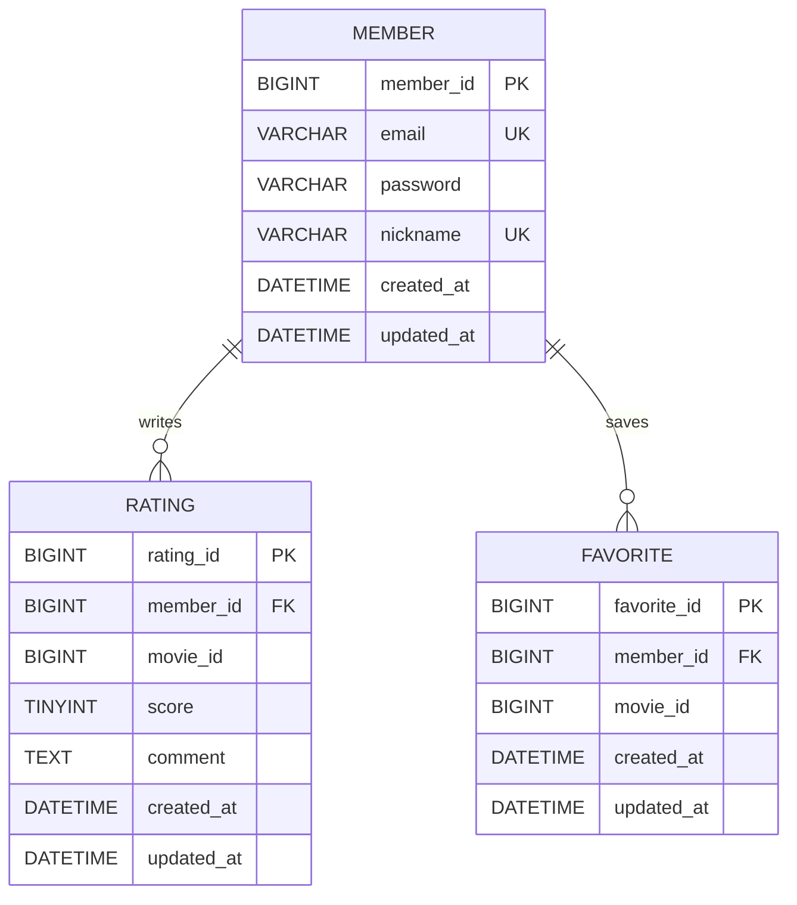

# 영화 평점 서비스 ERD

```mermaid
erDiagram
    MEMBER ||--o{ RATING : writes
    MEMBER ||--o{ FAVORITE : saves

    MEMBER {
        BIGINT member_id PK
        VARCHAR email UK
        VARCHAR password
        VARCHAR nickname UK
        DATETIME created_at
        DATETIME updated_at
    }
    RATING {
        BIGINT rating_id PK
        BIGINT member_id FK
        BIGINT movie_id
        TINYINT score
        TEXT comment
        DATETIME created_at
        DATETIME updated_at
    }
    FAVORITE {
        BIGINT favorite_id PK
        BIGINT member_id FK
        BIGINT movie_id
        DATETIME created_at
        DATETIME updated_at
    }
```

`rating`은 `(member_id, movie_id)` 조합이 unique입니다. `favorite`도 같은 조합을 unique로 제한합니다. `movie_id`는 TMDB 식별자이며 우리 DB의 FK가 아닙니다. 5주차에는 `favorite` 테이블만 만들어 두고 JPA 엔티티와 API는 추가하지 않습니다.
